# workflows para o n8n organizados de forma estratégica por nível de complexidade e categoria.

Cada fluxo traz a explicação prática, a lógica dos nós e um diagrama **Mermaid** com emojis que imitam a interface visual do n8n para facilitar a sua visualização.

---

## 📁 Categoria 0: Fundamentos (Nível Zero Absoluto)

### 01A. Olá Mundo Manual (Manual Trigger ➔ Edit Fields)

* **Gatilho:** `When Clicking "Test workflow"` (O gatilho manual mais simples do n8n).
* **Ações:** O nó `Edit Fields (Set)` é usado para criar manualmente um campo de texto (ex: `mensagem: "Olá, n8n!"`). Serve para entender como o n8n visualiza, estrutura e passa dados no formato JSON de um nó para o outro.

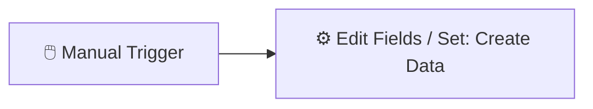

---

### 02A. Alerta de Mensagem Estática para o Telegram/Slack

* **Gatilho:** `Manual Trigger` ou um `Schedule Trigger` simples configurado para disparar uma única vez.
* **Ações:** Conecta-se diretamente ao nó do Telegram ou Slack para enviar uma frase puramente estática e fixa (ex: *"O fluxo de testes rodou com sucesso!"*). Essencial para aprender a configurar e testar credenciais e tokens de aplicativos externos pela primeira vez.

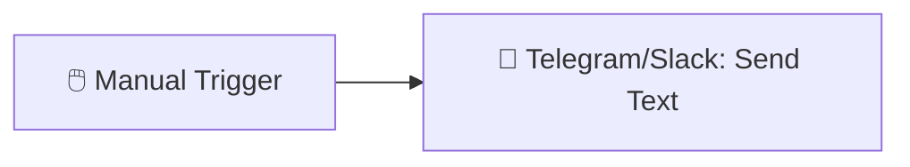

---

### 03A. O Teste do "Se" Perfeito (If/Filter Básico)

* **Gatilho:** `Manual Trigger`.
* **Ações:** Um nó `Edit Fields (Set)` cria uma propriedade numérica simulada (ex: `idade: 20`). O nó `If` avalia se o número é maior ou igual a 18. Se verdadeiro, segue para o caminho superior (`true`), se falso, segue para o inferior (`false`), apresentando o conceito de ramificação de fluxos.

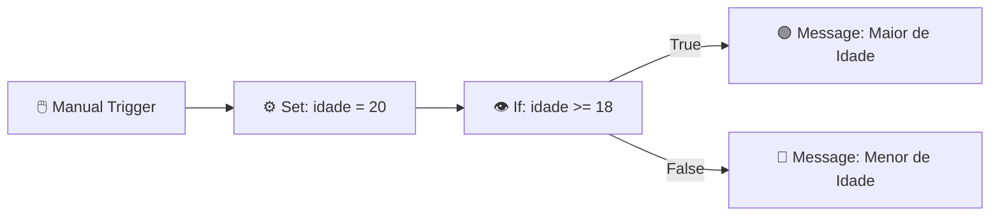

---

### 04A. Captura de Parâmetro via URL (Webhook GET Simples)

* **Gatilho:** `Webhook Trigger` configurado com o método `GET`.
* **Ações:** Você copia a URL gerada pelo n8n, cola no seu navegador e adiciona um parâmetro no final (ex: `?nome=Lucas`). O n8n captura a requisição instantaneamente e mostra na tela o seu nome estruturado dentro do nó. É a introdução perfeita ao conceito de comunicação via Webhooks.

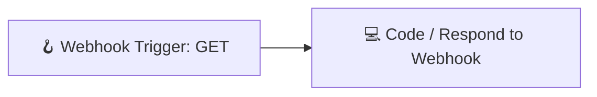

---

### 05A. Copiador de Linhas Simples (Planilha para Planilha)

* **Gatilho:** `Manual Trigger`.
* **Ações:** O nó do `Google Sheets` lê a primeira linha de uma "Planilha A" (Origem). O nó seguinte do `Google Sheets` simplesmente pega os dados exatos lidos e faz um append (inserção) em uma "Planilha B" (Destino). Ensina visualmente como mapear propriedades arrastando campos de dados entre nós.

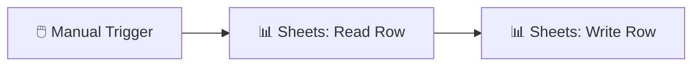

---

## 📁 Categoria 1: Produtividade & Organização Pessoal

### 01. Centralizador de Pendências (E-mail ➔ Todoist/Notion)

* **Gatilho:** `Gmail Trigger` / `Outlook Trigger` configurado para monitorar quando uma mensagem ganha uma estrela (`is:starred`).
* **Ações:** O nó do Notion/Todoist cria uma nova tarefa com o assunto do e-mail no título e a URL direta do e-mail no corpo.

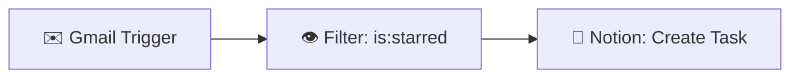

---

### 02. Resumo Diário de Reuniões no Slack/WhatsApp

* **Gatilho:** `Schedule Trigger` programado no estilo Cron (`0 7 * * 1-5` - Segunda a Sexta às 07:00).
* **Ações:** O nó do Google Calendar busca os eventos do dia atual, um nó `Code` formata o texto em uma lista limpa e legível, e o nó do Slack/WhatsApp envia o resumo.

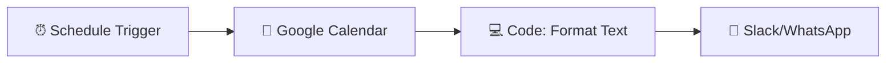

---

### 03. Backup Automático de Anexos Importantes

* **Gatilho:** `Gmail Trigger` filtrando por termos como `filename:pdf` ou remetentes específicos (ex: notas fiscais).
* **Ações:** O n8n baixa o arquivo binário do e-mail e o nó do Google Drive faz o upload em uma estrutura de pastas dinâmica baseada no ano/mês atual `{{ $today.format('yyyy/MM') }}`.

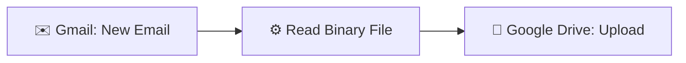

---

### 04. Time Tracking Automatizado com Toggl/Clockify

* **Gatilho:** `Notion Trigger` ou `Trello Trigger` monitorando a alteração da propriedade `Status` para `Em Andamento`.
* **Ações:** O nó do Toggl/Clockify captura o nome do card/página e inicia um novo *time entry* em tempo real.

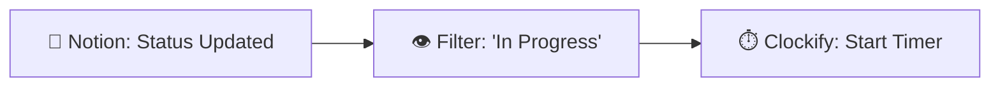

---

### 05. Limpeza Semanal de Arquivos Temporários

* **Gatilho:** `Schedule Trigger` executado todo domingo à meia-noite.
* **Ações:** Lista todos os arquivos de uma pasta do Google Drive/Dropbox, filtra os arquivos criados há mais de 7 dias e executa um loop deletando cada um.

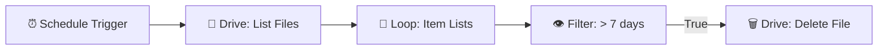

---

## 📁 Categoria 2: Marketing & Redes Sociais

### 06. Cross-posting de Conteúdo (RSS/Blog ➔ Redes Sociais)

* **Gatilho:** `RSS Read Trigger` monitorando o feed XML do seu blog ou site.
* **Ações:** Sempre que há um item novo, o n8n extrai o título e o link e distribui em paralelo para os nós do LinkedIn e do X (Twitter).

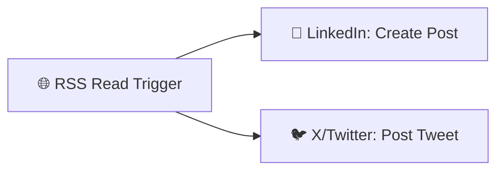

---

### 07. Alerta de Menções de Marca/Termos no Reddit

* **Gatilho:** `HTTP Request` em loop (ou nó customizado do Reddit) buscando termos específicos na API de busca do Reddit.
* **Ações:** Verifica se o ID do post já foi processado e envia o link direto da menção para o seu canal de monitoramento no Telegram/Discord.

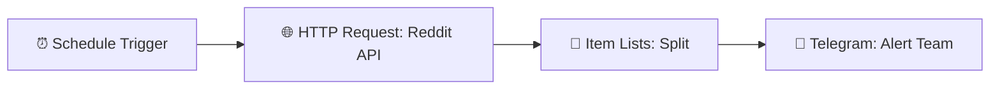

---

### 08. Captura de Leads de Formulário para Planilha + CRM

* **Gatilho:** `Webhook Trigger` recebendo o payload JSON de formulários como Typeform, Tally ou Elementor.
* **Ações:** Adiciona os dados coletados no Google Sheets e cria ou atualiza o contato dentro do HubSpot/ActiveCampaign.

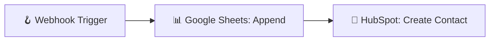

---

### 09. Distribuição de Vídeos (YouTube ➔ Redes Sociais)

* **Gatilho:** `YouTube Trigger` monitorando o ID de um canal específico para novos vídeos públicos.
* **Ações:** Dispara uma mensagem customizada contendo a thumbnail e o link do vídeo para comunidades do Discord ou canais do Telegram.

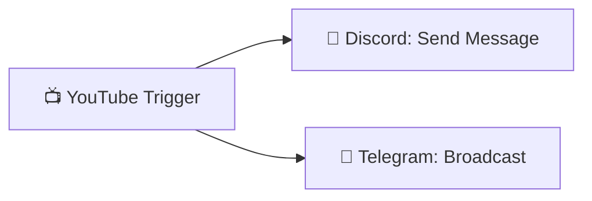

---

### 10. Envio de Recompensa Digital Automatizada

* **Gatilho:** `Webhook Trigger` vindo de um botão de captura em uma Landing Page.
* **Ações:** O nó `Wait` aguarda um intervalo curto para simular comportamento natural, e o nó do Mailgun ou SendGrid dispara o e-mail marketing com o anexo/link da recompensa.

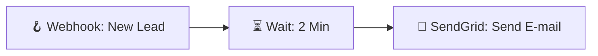

---

## 📁 Categoria 3: Finanças & Dados

### 11. Monitor de Cotação de Cripto/Moedas com Alerta

* **Gatilho:** `Schedule Trigger` disparando a cada 1 hora.
* **Ações:** Consome a API da CoinGecko (HTTP Request), o nó `If` compara se o valor é menor que o seu preço alvo e, se positivo, envia uma notificação push via Telegram.

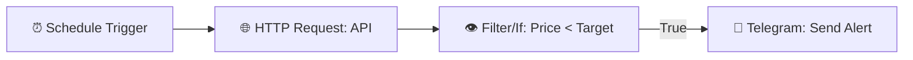

---

### 12. Alerta de Faturamento Diário (Stripe/Hotmart ➔ Chat)

* **Gatilho:** `Schedule Trigger` rodando todos os dias às 23:55.
* **Ações:** Puxa a lista de transações do dia via Stripe Node, o nó `Code` faz a soma matemática do campo `amount` e envia o faturamento total consolidado para o Slack dos sócios.

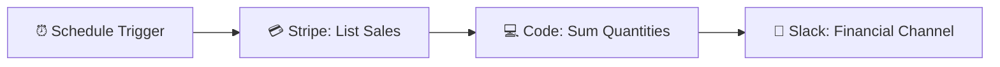

---

### 13. Conciliação Bancária Simples (E-mail ➔ Planilha)

* **Gatilho:** `Gmail Trigger` focado em e-mails com o assunto "Pix recebido" ou "Comprovante".
* **Ações:** Um nó `Code` usa Expressões Regulares (Regex) para varrer o texto do e-mail e extrair: Valor, Nome de quem enviou e Data. Depois, insere estruturado no Google Sheets.

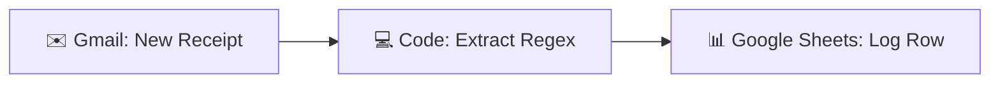

---

### 14. Dashboard de Métricas Automatizado

* **Gatilho:** `Schedule Trigger` configurado para toda segunda-feira de manhã.
* **Ações:** Executa uma query SQL (`SELECT COUNT(*)`) em um banco PostgreSQL/MySQL para contar novos usuários e escreve a métrica histórica em uma planilha do Google Sheets que alimenta seus gráficos.

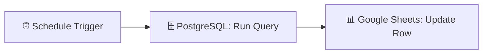

---

### 15. Monitor de Status de Sites (Uptime Robot Caseiro)

* **Gatilho:** `Schedule Trigger` rodando a cada 5 minutos de forma ininterrupta.
* **Ações:** Faz uma chamada `HTTP Request` para a home do seu site. Se a resposta retornar um código de erro (diferente de 200), envia um SMS ou mensagem emergencial no WhatsApp.

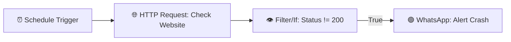

---

## 📁 Categoria 4: Integração de Sistemas & Operações

### 16. Webhook-to-Email Universal

* **Gatilho:** `Webhook Trigger` pronto para receber requisições HTTP POST de plataformas legadas.
* **Ações:** Captura o payload bruto (JSON), transforma as propriedades dinamicamente em uma tabela em formato HTML usando o nó `Code` e envia o relatório formatado por e-mail.

```mermaid
graph LR
    A[🪝 Webhook Trigger] --> B[💻 Code: JSON to HTML]
    B --> C[🚀 SendGrid/Gmail]

```

---

### 17. Alerta de Commits Importantes no GitHub

* **Gatilho:** `GitHub Trigger` configurado para escutar o evento de `Pull Request`.
* **Ações:** O nó `If` checa se o PR foi aceito (`merged == true`) e se o destino era a branch `main`. Se sim, avisa no canal de deploys da equipe de engenharia.

```mermaid
graph LR
    A[🐙 GitHub Trigger: PR] --> B[👁️ Filter: Merged to Main]
    B -- True --> C[💬 Discord: Deploy Alert]

```

---

### 18. Enriquecimento de Leads Básico com IA

* **Gatilho:** `Google Sheets Trigger` disparado quando uma nova linha (contendo o domínio de uma empresa) é adicionada.
* **Ações:** Passa o domínio dentro de um prompt estruturado para o nó `OpenAI` pesquisar/resumir o modelo de negócios daquela empresa e injeta a resposta de volta no Sheets.

```mermaid
graph LR
    A[📊 Google Sheets Trigger] --> B[🧠 OpenAI: Chat Model]
    B --> C[📊 Google Sheets: Update Row]

```

---

### 19. Conversor Automático de Arquivos (CSV para JSON)

* **Gatilho:** `Google Drive Trigger` disparado ao detectar um novo arquivo com extensão `.csv` em uma pasta específica.
* **Ações:** Lê o arquivo utilizando o gerenciador binário do n8n, passa pelo nó de conversão nativo para transformar linhas em objetos JSON e salva em um banco de dados relacional.

```mermaid
graph LR
    A[📁 Drive: New CSV File] --> B[⚙️ Read Binary Data]
    B --> C[🔄 Item Lists: Convert to JSON]
    C --> D[🗄️ MySQL: Bulk Insert]

```

---

### 20. Gerador de Relatório PDF com Base em Template

* **Gatilho:** `Webhook Trigger` contendo dados de um fechamento de contrato ou recibo.
* **Ações:** Mescla as variáveis em um código HTML base, utiliza um nó de conversão binária para renderizar o HTML em PDF e envia o arquivo finalizado como anexo para o cliente.

```mermaid
graph LR
    A[🪝 Webhook: Order Data] --> B[💻 Code: Populate HTML]
    B --> C[📄 Convert to Executive PDF]
    C --> D[✉️ Gmail: Send Attachment]

```
