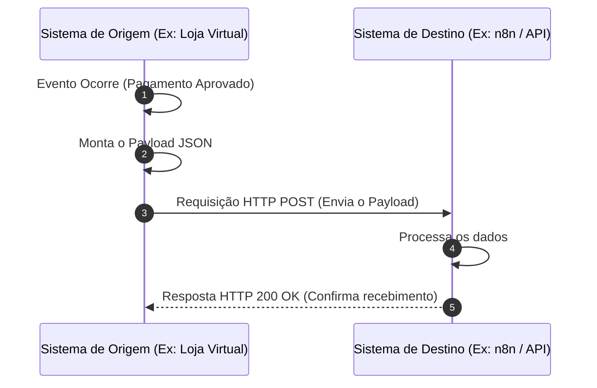
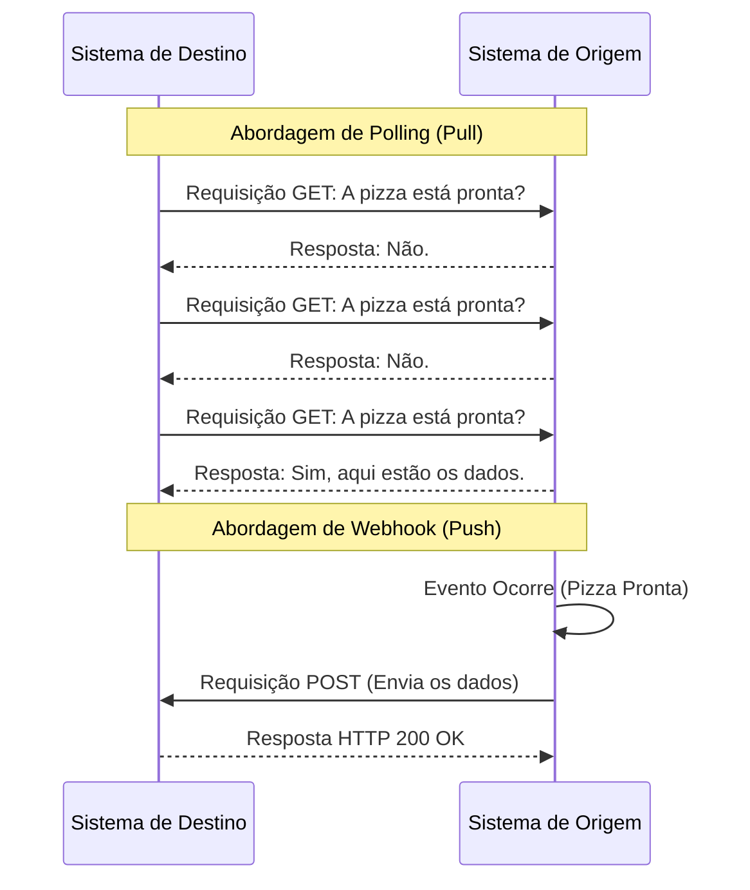
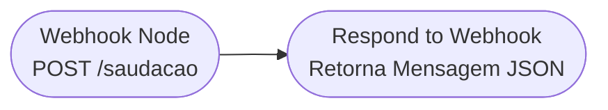
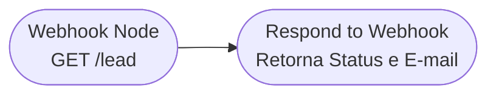
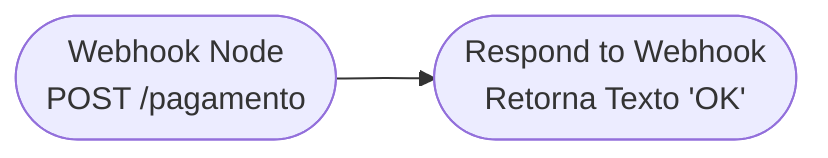
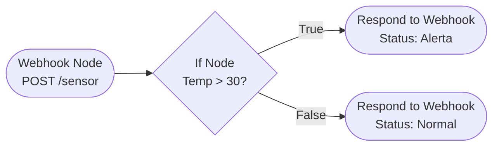
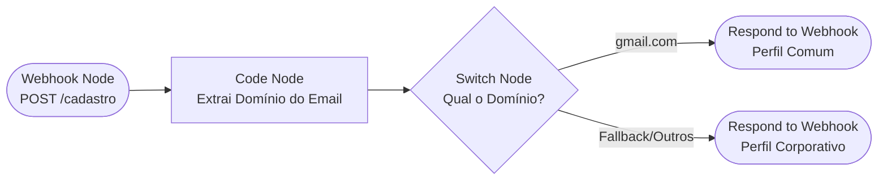

# Webhook e Payload no n8n — Guia Prático

Material didático introdutório sobre **Webhooks** e **Payloads**, com comparação entre Webhook e Polling e cinco exercícios práticos resolvidos no n8n (com equivalente em Node.js/Express e os prompts usados para gerá-los).

## Índice

- [Introdução Básica ao Webhook e Payload](#introdução-básica-ao-webhook-e-payload)
  - [O que é um Webhook?](#o-que-é-um-webhook)
  - [O que é um Payload?](#o-que-é-um-payload)
  - [Fluxo Visual de uma Notificação por Webhook](#fluxo-visual-de-uma-notificação-por-webhook)
- [Diferença entre Webhook e Polling](#diferença-entre-webhook-e-polling)
- [Exercícios Práticos](#exercícios-práticos)
  - [Exercício 1 (Fácil): Saudação Personalizada](#exercício-1-fácil-saudação-personalizada)
  - [Exercício 2 (Fácil): Coleta de Leads via GET](#exercício-2-fácil-coleta-de-leads-via-get)
  - [Exercício 3 (Fácil): Confirmação de Status Estático](#exercício-3-fácil-confirmação-de-status-estático)
  - [Exercício 4 (Médio): Filtro de Temperatura de Sensores](#exercício-4-médio-filtro-de-temperatura-de-sensores)
  - [Exercício 5 (Médio): Roteamento por Domínio de E-mail](#exercício-5-médio-roteamento-por-domínio-de-e-mail)

---

## Introdução Básica ao Webhook e Payload

### O que é um Webhook?

Um Webhook é um mecanismo que permite que um sistema envie informações em tempo real para outro sistema assim que um evento específico ocorre.

Para compreender o conceito, imagine que você pediu uma pizza.
Sem um Webhook, você ligaria para a pizzaria a cada 5 minutos perguntando: "A pizza já está pronta?" (isso é Polling).
Com um Webhook, você deixa o seu número de telefone com a pizzaria e diz: "Me ligue assim que a pizza estiver pronta". A pizzaria toma a iniciativa de informar você no exato momento em que o evento (pizza pronta) ocorre, economizando tempo e esforço de ambas as partes.

### O que é um Payload?

No contexto de Webhooks, o Payload é a "carga útil" da requisição. É o pacote de dados que o sistema de origem envia para o sistema de destino. Sua função é carregar as informações detalhadas sobre o evento que acabou de acontecer.

Por exemplo, se o evento for "Novo Pedido Criado", o payload conterá os dados desse pedido.

Exemplo de um Payload simples (formato JSON):

```json
{
  "id_pedido": 10234,
  "cliente": {
    "nome": "Lucas Pimentel",
    "email": "lucas@exemplo.com"
  },
  "valor_total": 150.00,
  "status": "aprovado"
}
```

### Fluxo Visual de uma Notificação por Webhook

A sequência abaixo ilustra a comunicação entre o sistema onde o evento ocorre e o sistema que recebe os dados:



---

## Diferença entre Webhook e Polling

A principal diferença reside em quem toma a iniciativa da comunicação.

| Característica | Webhook (Push) | Polling (Pull) |
| --- | --- | --- |
| **Iniciativa** | O servidor de origem envia os dados ao destino. | O sistema de destino pergunta repetidamente por dados. |
| **Tempo Real** | Sim, os dados chegam assim que o evento ocorre. | Não, depende do intervalo configurado para as consultas. |
| **Consumo de Recursos** | Baixo. Só há tráfego de rede quando há novos dados. | Alto. Gera tráfego de rede constante, mesmo sem dados novos. |
| **Analogia** | Receber uma notificação de mensagem no celular. | Atualizar a página de e-mails manualmente a cada minuto. |

Este diagrama de sequência compara lado a lado o comportamento do Polling (várias requisições sem dados novos) e do Webhook (comunicação iniciada apenas quando o evento acontece):



---

## Exercícios Práticos

### Exercício 1 (Fácil): Saudação Personalizada

**Título e Cenário/Problema:**
Você precisa de um endpoint simples que receba o nome de um usuário via Webhook e retorne uma mensagem de boas-vindas customizada em formato JSON.

**Passos de configuração no n8n e Resultado Esperado:**

1. Adicione um nó Webhook. Configure o Método HTTP para POST, o Path para `saudacao` e o "Respond" para Using 'Respond to Webhook' Node.
2. Adicione um nó Respond to Webhook. Configure o "Respond With" para JSON. No campo Response Body, adicione: `{"mensagem": "Olá, {{ $json.body.nome }}!"}`.
3. Conecte o Webhook ao Respond to Webhook.

**Resultado Esperado:** Ao enviar um POST com `{"nome": "Maria"}`, o fluxo retorna `{"mensagem": "Olá, Maria!"}`.

**Fluxo no n8n:**



**Código JSON do n8n:**

```json
{
  "nodes": [
    {
      "parameters": {
        "httpMethod": "POST",
        "path": "saudacao",
        "responseMode": "responseNode",
        "options": {}
      },
      "name": "Webhook",
      "type": "n8n-nodes-base.webhook",
      "typeVersion": 1.1,
      "position": [180, 240]
    },
    {
      "parameters": {
        "respondWith": "json",
        "responseBody": "={\n  \"mensagem\": \"Olá, {{ $json.body.nome }}!\"\n}",
        "options": {}
      },
      "name": "Respond to Webhook",
      "type": "n8n-nodes-base.respondToWebhook",
      "typeVersion": 1,
      "position": [400, 240]
    }
  ],
  "connections": {
    "Webhook": {
      "main": [
        [
          {
            "node": "Respond to Webhook",
            "type": "main",
            "index": 0
          }
        ]
      ]
    }
  }
}
```

**Implementação em JavaScript (Node.js/Express):**

```javascript
const express = require('express');
const app = express();

app.use(express.json());

app.post('/saudacao', (req, res) => {
    const nome = req.body.nome || 'Visitante';
    res.json({ mensagem: `Olá, ${nome}!` });
});

app.listen(3000, () => console.log('Servidor rodando na porta 3000'));
```

**Prompt para gerar este script JS:**

> Escreva um script em Node.js usando a biblioteca Express. Crie uma rota POST no caminho "/saudacao" que receba um JSON contendo a propriedade "nome". A rota deve retornar um objeto JSON com uma propriedade "mensagem" formatada como "Olá, [nome]!". A aplicação deve rodar na porta 3000.

---

### Exercício 2 (Fácil): Coleta de Leads via GET

**Título e Cenário/Problema:**
Um sistema de marketing envia dados de novos leads através de parâmetros de URL (Query Parameters). O endpoint deve extrair o e-mail e confirmar o recebimento.

**Passos de configuração no n8n e Resultado Esperado:**

1. Adicione um nó Webhook. Configure o Método HTTP para GET, Path para `lead`, e "Respond" para Using 'Respond to Webhook' Node.
2. Adicione um nó Respond to Webhook. Configure "Respond With" para JSON. No Response Body, insira `{"status": "sucesso", "email_recebido": "{{ $json.query.email }}"}`.

**Resultado Esperado:** Acessar a URL do webhook adicionando `?email=teste@empresa.com` retornará um JSON confirmando a captura daquele e-mail específico.

**Fluxo no n8n:**



**Código JSON do n8n:**

```json
{
  "nodes": [
    {
      "parameters": {
        "path": "lead",
        "responseMode": "responseNode",
        "options": {}
      },
      "name": "Webhook",
      "type": "n8n-nodes-base.webhook",
      "typeVersion": 1.1,
      "position": [180, 460]
    },
    {
      "parameters": {
        "respondWith": "json",
        "responseBody": "={\n  \"status\": \"sucesso\",\n  \"email_recebido\": \"{{ $json.query.email }}\"\n}",
        "options": {}
      },
      "name": "Respond to Webhook",
      "type": "n8n-nodes-base.respondToWebhook",
      "typeVersion": 1,
      "position": [400, 460]
    }
  ],
  "connections": {
    "Webhook": {
      "main": [
        [
          {
            "node": "Respond to Webhook",
            "type": "main",
            "index": 0
          }
        ]
      ]
    }
  }
}
```

**Implementação em JavaScript (Node.js/Express):**

```javascript
const express = require('express');
const app = express();

app.get('/lead', (req, res) => {
    const email = req.query.email;
    res.json({
        status: 'sucesso',
        email_recebido: email
    });
});

app.listen(3000, () => console.log('Servidor rodando na porta 3000'));
```

**Prompt para gerar este script JS:**

> Escreva um script em Node.js com Express que defina uma rota GET no caminho "/lead". A rota deve ler o parâmetro de query "email" e retornar um JSON contendo "status": "sucesso" e "email_recebido": [valor do email passado na url].

---

### Exercício 3 (Fácil): Confirmação de Status Estático

**Título e Cenário/Problema:**
Sistemas de pagamento frequentemente exigem um simples "HTTP 200 OK" para confirmar que a notificação foi recebida, sem necessidade de processamento síncrono da resposta.

**Passos de configuração no n8n e Resultado Esperado:**

1. Adicione um nó Webhook. Configure Método HTTP para POST, Path para `pagamento`, e "Respond" para Using 'Respond to Webhook' Node.
2. Adicione um nó Respond to Webhook. Configure "Respond With" para Text. No campo texto, escreva apenas `OK`.

**Resultado Esperado:** Qualquer POST enviado para a URL receberá imediatamente o texto "OK" com o status HTTP 200, liberando o sistema de origem enquanto o n8n pode continuar processando os dados do pagamento em nós subsequentes.

**Fluxo no n8n:**



**Código JSON do n8n:**

```json
{
  "nodes": [
    {
      "parameters": {
        "httpMethod": "POST",
        "path": "pagamento",
        "responseMode": "responseNode",
        "options": {}
      },
      "name": "Webhook",
      "type": "n8n-nodes-base.webhook",
      "typeVersion": 1.1,
      "position": [180, 680]
    },
    {
      "parameters": {
        "respondWith": "text",
        "responseText": "OK",
        "options": {}
      },
      "name": "Respond to Webhook",
      "type": "n8n-nodes-base.respondToWebhook",
      "typeVersion": 1,
      "position": [400, 680]
    }
  ],
  "connections": {
    "Webhook": {
      "main": [
        [
          {
            "node": "Respond to Webhook",
            "type": "main",
            "index": 0
          }
        ]
      ]
    }
  }
}
```

**Implementação em JavaScript (Node.js/Express):**

```javascript
const express = require('express');
const app = express();

app.post('/pagamento', (req, res) => {
    res.status(200).send('OK');
});

app.listen(3000, () => console.log('Servidor rodando na porta 3000'));
```

**Prompt para gerar este script JS:**

> Crie um servidor Express em Node.js com uma rota POST no caminho "/pagamento". Esta rota deve ignorar qualquer payload recebido e apenas responder com o status HTTP 200 e a string de texto simples "OK".

---

### Exercício 4 (Médio): Filtro de Temperatura de Sensores

**Título e Cenário/Problema:**
Um sensor IoT envia dados de temperatura regularmente via Webhook POST. Você precisa verificar o valor da temperatura. Se for maior que 30 graus, envie um aviso de alerta; caso contrário, retorne que está tudo normal.

**Passos de configuração no n8n e Resultado Esperado:**

1. Adicione um nó Webhook (POST, Path `sensor`, responseMode Using 'Respond to Webhook' Node).
2. Adicione um nó If. Configure a condição: Número 1 será `{{ $json.body.temperatura }}`, operador Larger, Número 2 será `30`.
3. Adicione dois nós Respond to Webhook.
   - Nó 1 (Conectado à saída 'True' do If): Retorna o JSON `{"status": "alerta", "mensagem": "Temperatura alta detectada!"}`.
   - Nó 2 (Conectado à saída 'False' do If): Retorna o JSON `{"status": "normal", "mensagem": "Temperatura dentro do padrão."}`.

**Resultado Esperado:** Enviar `{"temperatura": 35}` retorna o alerta. Enviar `{"temperatura": 22}` retorna o aviso normal.

**Fluxo no n8n:**



**Código JSON do n8n:**

```json
{
  "nodes": [
    {
      "parameters": {
        "httpMethod": "POST",
        "path": "sensor",
        "responseMode": "responseNode",
        "options": {}
      },
      "name": "Webhook",
      "type": "n8n-nodes-base.webhook",
      "typeVersion": 1.1,
      "position": [180, 200]
    },
    {
      "parameters": {
        "conditions": {
          "number": [
            {
              "value1": "={{ $json.body.temperatura }}",
              "operation": "larger",
              "value2": 30
            }
          ]
        }
      },
      "name": "If",
      "type": "n8n-nodes-base.if",
      "typeVersion": 1,
      "position": [380, 200]
    },
    {
      "parameters": {
        "respondWith": "json",
        "responseBody": "{\n  \"status\": \"alerta\",\n  \"mensagem\": \"Temperatura alta detectada!\"\n}",
        "options": {}
      },
      "name": "Respond Alerta",
      "type": "n8n-nodes-base.respondToWebhook",
      "typeVersion": 1,
      "position": [620, 100]
    },
    {
      "parameters": {
        "respondWith": "json",
        "responseBody": "{\n  \"status\": \"normal\",\n  \"mensagem\": \"Temperatura dentro do padrão.\"\n}",
        "options": {}
      },
      "name": "Respond Normal",
      "type": "n8n-nodes-base.respondToWebhook",
      "typeVersion": 1,
      "position": [620, 300]
    }
  ],
  "connections": {
    "Webhook": {
      "main": [
        [
          {
            "node": "If",
            "type": "main",
            "index": 0
          }
        ]
      ]
    },
    "If": {
      "main": [
        [
          {
            "node": "Respond Alerta",
            "type": "main",
            "index": 0
          }
        ],
        [
          {
            "node": "Respond Normal",
            "type": "main",
            "index": 0
          }
        ]
      ]
    }
  }
}
```

**Implementação em JavaScript (Node.js/Express):**

```javascript
const express = require('express');
const app = express();

app.use(express.json());

app.post('/sensor', (req, res) => {
    const temperatura = req.body.temperatura;

    if (temperatura > 30) {
        res.json({ status: 'alerta', mensagem: 'Temperatura alta detectada!' });
    } else {
        res.json({ status: 'normal', mensagem: 'Temperatura dentro do padrão.' });
    }
});

app.listen(3000, () => console.log('Servidor rodando na porta 3000'));
```

**Prompt para gerar este script JS:**

> Escreva um script Node.js com Express contendo uma rota POST "/sensor". A rota deve extrair "temperatura" do body JSON. Se a temperatura for maior que 30, retorne um JSON com status "alerta" e mensagem "Temperatura alta detectada!". Caso contrário, retorne status "normal" e mensagem "Temperatura dentro do padrão.".

---

### Exercício 5 (Médio): Roteamento por Domínio de E-mail

**Título e Cenário/Problema:**
Você recebe cadastros de usuários via Webhook. O sistema precisa extrair o domínio do e-mail usando código customizado e tomar decisões baseadas nisso: se for domínio "gmail.com", o usuário ganha acesso ao perfil comum. Qualquer outro domínio ganha perfil corporativo.

**Passos de configuração no n8n e Resultado Esperado:**

1. Adicione um nó Webhook (POST, Path `cadastro`, responseMode Using 'Respond to Webhook' Node).
2. Adicione um nó Code. Use o seguinte JavaScript para extrair o domínio e adicioná-lo ao item: `$input.item.json.dominio = $input.item.json.body.email.split('@')[1]; return $input.item;`
3. Adicione um nó Switch. Avalie o valor `{{ $json.dominio }}`. Crie a rota 0 para o valor exato `gmail.com`. Ative a saída de Fallback.
4. Conecte dois nós Respond to Webhook nas saídas do Switch (Rota 0 = Perfil Comum; Rota Fallback = Perfil Corporativo).

**Resultado Esperado:** Enviar `teste@gmail.com` retorna "Perfil Comum". Enviar `ceo@empresa.com` retorna "Perfil Corporativo".

**Fluxo no n8n:**



**Código JSON do n8n:**

```json
{
  "nodes": [
    {
      "parameters": {
        "httpMethod": "POST",
        "path": "cadastro",
        "responseMode": "responseNode",
        "options": {}
      },
      "name": "Webhook",
      "type": "n8n-nodes-base.webhook",
      "typeVersion": 1.1,
      "position": [180, 200]
    },
    {
      "parameters": {
        "jsCode": "$input.item.json.dominio = $input.item.json.body.email.split('@')[1];\nreturn $input.item;"
      },
      "name": "Code",
      "type": "n8n-nodes-base.code",
      "typeVersion": 2,
      "position": [360, 200]
    },
    {
      "parameters": {
        "dataType": "string",
        "value1": "={{ $json.dominio }}",
        "rules": {
          "rules": [
            {
              "value2": "gmail.com"
            }
          ]
        },
        "fallbackOutput": 1
      },
      "name": "Switch",
      "type": "n8n-nodes-base.switch",
      "typeVersion": 1,
      "position": [560, 200]
    },
    {
      "parameters": {
        "respondWith": "json",
        "responseBody": "{\n  \"perfil\": \"Perfil Comum\"\n}",
        "options": {}
      },
      "name": "Respond Comum",
      "type": "n8n-nodes-base.respondToWebhook",
      "typeVersion": 1,
      "position": [780, 100]
    },
    {
      "parameters": {
        "respondWith": "json",
        "responseBody": "{\n  \"perfil\": \"Perfil Corporativo\"\n}",
        "options": {}
      },
      "name": "Respond Corporativo",
      "type": "n8n-nodes-base.respondToWebhook",
      "typeVersion": 1,
      "position": [780, 300]
    }
  ],
  "connections": {
    "Webhook": {
      "main": [
        [
          {
            "node": "Code",
            "type": "main",
            "index": 0
          }
        ]
      ]
    },
    "Code": {
      "main": [
        [
          {
            "node": "Switch",
            "type": "main",
            "index": 0
          }
        ]
      ]
    },
    "Switch": {
      "main": [
        [
          {
            "node": "Respond Comum",
            "type": "main",
            "index": 0
          }
        ],
        [
          {
            "node": "Respond Corporativo",
            "type": "main",
            "index": 0
          }
        ]
      ]
    }
  }
}
```

**Implementação em JavaScript (Node.js/Express):**

```javascript
const express = require('express');
const app = express();

app.use(express.json());

app.post('/cadastro', (req, res) => {
    const email = req.body.email || '';
    const dominio = email.split('@')[1];

    if (dominio === 'gmail.com') {
        res.json({ perfil: 'Perfil Comum' });
    } else {
        res.json({ perfil: 'Perfil Corporativo' });
    }
});

app.listen(3000, () => console.log('Servidor rodando na porta 3000'));
```

**Prompt para gerar este script JS:**

> Desenvolva um script Node.js usando Express com uma rota POST em "/cadastro". A rota deve extrair a propriedade "email" do body da requisição, isolar o domínio do email (o que vem após o @) e criar uma lógica de condicional: se o domínio for "gmail.com", retorne um JSON com a chave "perfil" igual a "Perfil Comum". Se for qualquer outro domínio, retorne "Perfil Corporativo".
